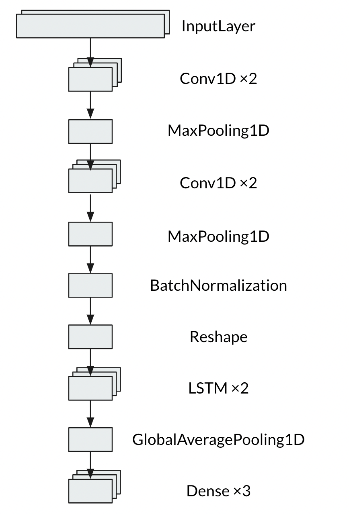

# ParoxysmalAtrialFibrillationEventsDetection

## Table of Contents
- [Abstract](#link-part-1)
- [Design](#link-part-2)
- [Data](#link-part-3)
- [Algorithm](#link-part-4)
- [Tools](#link-part-5)
- [Communication](#link-part-6)

## <a name="link-part-1">Abstract</a>

Atrial fibrillation (AF) is the most frequent arrhythmia, but paroxysmal atrial
fibrillation (PAF) often remains unrecognized. Previous AF detection algorithms
usually focus on the classification of AF rhythm instead of locating the onsets
and ends of AF episodes. My goal is to develop an algorithm that search the AF
episodes in dynamic ECG records.

## <a name="link-part-2">Design</a>

This project comes from the [The 4th China Physiological Signal Challenge](https://physionet.org/content/cpsc2021/1.0.0/)
in 2021. The data is sourced from 12-lead Holter or 3-lead wearable ECG monitoring
devices. Early detection of paroxysmal atrial fibrillation (PAF) events is particularly
important, which is of great value for AF surgery options, drug intervention and
the diagnosis and treatment of various clinical complications.

## <a name="link-part-3">Data</a>

Get the dataset by running this command:
```
wget -r -N -c -np https://physionet.org/files/cpsc2021/1.0.0/
```

The data is recorded from 12-lead Holter or 3-lead wearable ECG monitoring
devices. It provides variable-length ECG records extracted from lead I and lead II
of the long-term dynamic ECGs, each sampled at 200 Hz.

The training set in the 1st stage consists of 730 records, extracted from the Holter
records from 12 AF patients (5PAF patients) and 42 non-AF patients (usually including
other abnormal and normal rhythms).

The training set in the 2nd stage consists of 706 records from 37 AF patients (18 PAF
patients) and 14 non-AF patients.

## <a name="link-part-4">Algorithm</a>

**Data Cleaning:**

- Select record name, signals, fs, beat locations, af start scripts, af end scripts
and class true features and save them into a list of dictionaries
- Filter the signals and get all r-peaks of the ecg records using Biosppy

**Model:**

A 1D Convolutional Recurrent Neural Network model is used to solve this problem. It
takes 8 heartbeats (1500 samples) as input, and output the possibility of the last
heartbeat experiencing atrial fibrillation (AF) and the possibility of it not
experiencing AF.

<div align=center >
    
</div>

**Model Evaluation and Selection:**

The data was split into 80/20 train vs. holdout (Considering my laptop's performance,
I  only used 1/4 of the training set which is 250 recordings to train the model). All
scores reported was evaluated on validation and test set. In the original challenge,
it allows the algorithm to predict AF two heartbeat earlier and two heartbeat later.
However, in this case, there isn't any tolerance.

**Final scores:**

- Accuracy on validation set: 0.953
- Loss on validation set: 0.193


- Accuracy on test set: 0.953
- Loss on test set: 0.128

## <a name="link-part-5">Tools</a>

* **Python waveform-database package** for reading the data
* **Biosppy** for ecg processing.
* **Tensorflow** for modeling.
* **Pickle** for saving data in a pickle file.

## <a name="link-part-6">Communication</a>

The project proposal is shown [here](/documents/proposal.md).

The MVP document is shown [here](/documents/MVP.md).

The slides are shown [here](/documents/slides.pdf).
