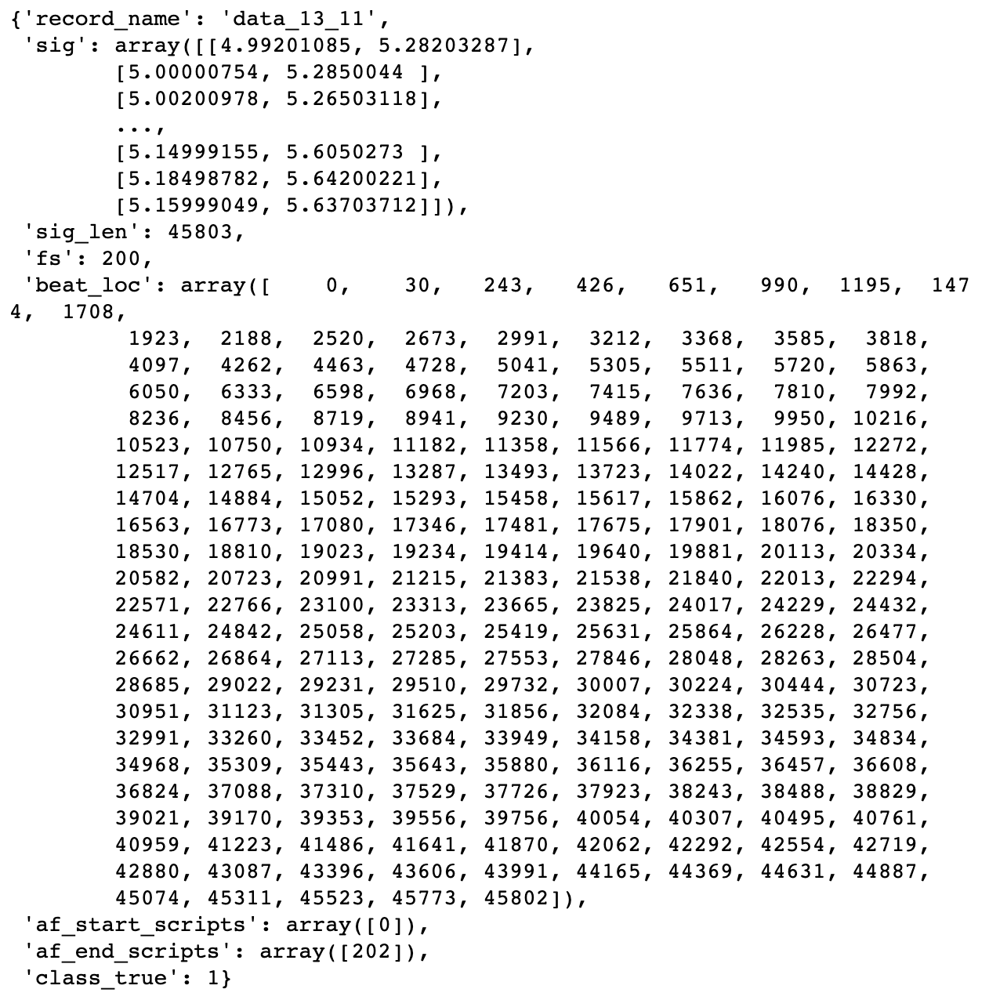

# MVP

## Data Processing

Firstly, I extracted the data and saved it into json forms. One of the data
is shown below. 25% of the data is randomly splited into test data. 

- **record name**: the name of the record
- **sig**: patients' signals, also the input
- **sig_len**: signal's length
- **fs**: samping rate
- **beat_loc**: every heartbeat's location
- **af_start_scripts**: AF start locations
- **af_end_scripts**: AF end locations
- **class_true**: 0 = none AF, 1 = persistent AF, 2 = paroxysmal AF

## Baseline model

The baseline model is built [here](../models/baseline.ipynb).

The model is a 1D convolutional neural network with a masking layer (filling 0 for inputs less than 200 samples), four convolutional layers, two pooling layers and
three fully connected dense layers, and will classify if the patient is experiencing
AF every second (200 samples).

It scored 0.968 on accuracy on the validation dataset.

